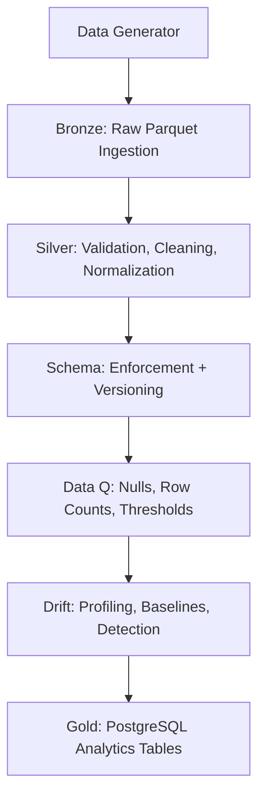

# NBA Player Data Engineering Platform (V3.1)

## Overview

This project is a **production-style batch Data Engineering platform** that simulates how real-world analytics pipelines are built, validated, orchestrated, and debugged.

The system ingests synthetic NBA player statistics, applies **Bronze → Silver → Gold** transformations, enforces **schema and data quality contracts**, detects **data drift**, and loads analytics-ready data into **PostgreSQL**, all orchestrated using **Apache Airflow**.

> ⚠️ **This is not a tutorial project.** > The focus is on **correctness, reliability, observability, and failure handling**, not just “making data move.”

---

## Architecture Summary



---

## Key Design Principles

* **Parquet-first storage** (single source of truth)
* **Snapshot-based incremental processing**
* **Idempotent loads**
* **Schema enforcement with versioning**
* **Data quality gates**
* **Drift detection**
* **Explicit failure signaling**
* **Airflow orchestration without Docker**

---

## Tech Stack

| Category | Technology |
| --- | --- |
| **Language** | Python |
| **Storage** | Parquet |
| **Database** | PostgreSQL |
| **Orchestration** | Apache Airflow |
| **Validation** | Pandas |
| **Config** | YAML |
| **Observability** | Logs + Metrics + Alerts |

---

## Project Structure

```text
nba-player-etl/
├── src/
│   ├── generator/       # Synthetic data generation
│   ├── ingestion/       # Bronze ingestion (Parquet)
│   ├── validation/      # Silver validation & cleaning
│   ├── schema/          # Schema enforcement & evolution
│   ├── quality/         # Data quality checks
│   ├── drift/           # Drift profiling & detection
│   ├── loader/          # Gold layer (Postgres)
│   ├── alerts/          # Alert manager
│   └── common/          # Logger, config loader
│
├── schema_registry/     # Versioned schema definitions
├── data/                # Local data (bronze/silver)
├── metrics/             # Observability outputs
├── airflow/             # Local Airflow home
└── README.md

```

---

## Pipeline Versions

### V1

* Basic batch ETL
* Bronze → Silver → Gold
* Parquet storage

### V2

* Schema enforcement & versioning
* Data quality checks
* Alerts & metrics

### V3.1 (Current, Stable)

* Parquet-only execution path
* Drift profiling & baselines
* Snapshot tracking & idempotent Gold loads
* Airflow orchestration & forced-failure testing
* End-to-end observability

> 🚦 **Project Status:** Intentionally stops at **V3.1** to avoid feature creep and focus on correctness.

---

## Configuration

### `base.yaml`

Defines snapshot columns, minimum row thresholds, retry behavior, data quality thresholds, and drift detection settings.

### `schema_v1.yaml`

Defines column names, data types, and nullability rules.

---

## Running the Pipeline (Without Airflow)

> Use this for local debugging and validation.

```bash
cd nba-player-etl
python3 -m venv venv
source venv/bin/activate
pip install -r requirements.txt

export PYTHONPATH=$(pwd)

# Step-by-step execution
python3 -m src.generator.generate_csv
python3 -m src.ingestion.ingest_raw_parquet
python3 -m src.validation.validate_clean_parquet
python3 -m src.schema.schema_check_parquet
python3 -m src.quality.data_quality_check_parquet
python3 -m src.drift.profiler
python3 -m src.drift.baseline
python3 -m src.drift.detector
python3 -m src.loader.load_postgres

```

---

## Running with Airflow (Local, No Docker)

1. **Set Airflow Home**
```bash
export AIRFLOW_HOME=~/airflow

```


2. **Initialize Airflow DB (Airflow 3.x)**
```bash
airflow db migrate

```


3. **Start Airflow (Standalone)**
```bash
airflow standalone

```


4. **Place DAG**
```bash
cp airflow/dags/nba_player_etl_v3.py ~/airflow/dags/

```


5. **Trigger DAG**
* Open Airflow UI
* Trigger `nba_player_etl_v3`


---

## Failure Handling & Observability

**What happens on failure?**

* Pipeline stops immediately.
* Snapshot is **not** marked processed.
* Alerts are emitted and metrics are appended (not overwritten).

**Observability Artifacts:**

* Schema enforcement metrics
* Data quality and Drift metrics
* Structured logs per stage

---

## What This Project Demonstrates

* Designing reliable data pipelines
* Debugging Airflow execution issues
* Handling schema evolution safely
* Preventing silent data corruption
* Building systems, not just scripts

---

## Lessons Learned

* **Python module resolution** matters more than tooling.
* **Orchestration** exposes design flaws quickly.
* **Reliability** is more valuable than feature count.
* **Debugging** is a core Data Engineering skill.

---
